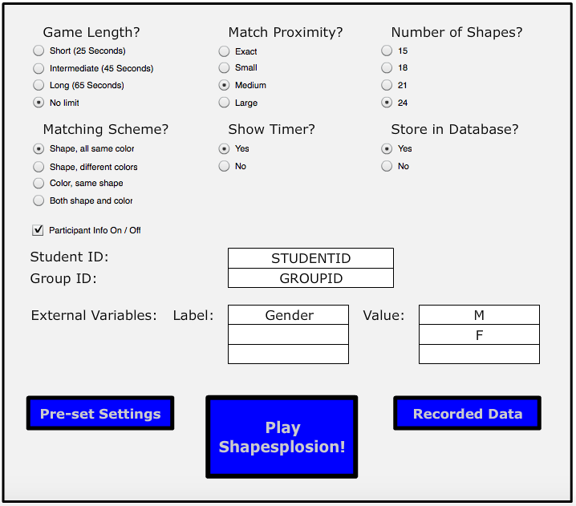

```{r setup, include=FALSE}
knitr::opts_chunk$set(echo = TRUE)
```
## Objective
In order to better understand the meaning of a p-value, we are going to compare multiple studies that all conducted similar tests.

## Data 

*Need to add more explanation of the game and a screenshot of the game webpage*

Shapesplosion is an on-line game in which a person is expected to place specifically shaped pegs into the appropriate holes within a short time period. For several years students have used the Shapesplosion game to design an experiment and collect data. The following link allows you to play the game (http://web.grinnell.edu/individuals/kuipers/stat2labs/Perfection.html). 

Here is a screenshot of the start page where the users can choose their preferred settings for the game.




In this lab, we will review data from multiple student groups that focused on a specific research question:

> “Does gender affect the time used to play Shapesplosion game?”

## Part One

### Conducting a hypothesis on one study

We will start our analysis with one study that is based on the entire sample. The following code will import your data and conduct a two-sample t-test.

``` {r, results='hide', message=FALSE}
library(mosaic)
library(ggplot2)
```

```{r}
## Reading in the data
group_data <- read.csv("cleaned_gender.csv")
```


```{r}
## Consucting a two-sided t-test using the entire dataset
female <- group_data[group_data$gender == 0,]$TimeUsedSec
male <- group_data[group_data$gender == 1,]$TimeUsedSec
t_test<- t.test(male,female,alternative="two.sided")
t_test
```

> Question 1: Use the code below to create a dotplot and boxplot of the data. Does it seem reasonable to use a two sample t-test for this data?  

```{r graph1}
group_data$gender= as.factor(group_data$gender)
ggplot(data=group_data, aes(x=gender, y=TimeUsedSec)) + geom_boxplot()  + aes(colour=gender) + theme(legend.position="top") + labs(title="Figure 1: boxplot of full dataset") +   stat_summary(fun.y = mean, geom = "point", pch = 8, cex = 3)

```


> Question 2: Write two to three sentences clearly stating conclusions can you draw from this study. Please assume that the data was collected properly from a class of ___ students in an introductory statistics class. 

*As the result above suggested, the p value for two-sided t-test performed above on the overall group is 0.00369. It suggests that on an alpha level of 0.05, the probability of obtaining a mean difference as extreme as 2.92(test statistics) or -2.92 is less than 0.05. Therefore, just based on the result from this sample, we may conclude that gender does have an effect on the play time of the game.*


### Conducting two hypothesis tests on a second study

Let’s repeat our analysis on a new study, using the group_ID “MATH22015”, which is a subset of the full dataset.


```{r}
MATH22015<-group_data[group_data$groupID=="MATH22015",]
MAT_female <- MATH22015[MATH22015$gender == 0,]$TimeUsedSec
MAT_male <- MATH22015[MATH22015$gender == 1,]$TimeUsedSec
MAT_t_test <- t.test(MAT_male,MAT_female,alternative="two.sided")

```

This study resulted in a p-value of 0.0776. Using an alpha level of 0.1, this study would have evidence to reject the null hypothesis and concluded that gender indeed makes a difference in play time of the game.

The graph also suggests that female players on average take less time to play the game than male players, contrary to our previous findings.


```{r graph}
MATH22015$gender= as.factor(MATH22015$gender)

ggplot(data=MATH22015, aes(x=gender, y=MATH22015$TimeUsedSec)) + geom_boxplot()  + theme(legend.position="top") + labs(title="Figure 2: boxplot of MATH22015 dataset") + aes(colour = gender)+ 
  stat_summary(fun.y = mean, geom = "point", pch = 8, cex = 3)
```

Take another subdataset with groupID = hjf190f14, let us again conduct a hypothesis test on this group.

```{r}
mth22602 <-group_data[group_data$groupID=="mth22602",]
mth_female <- mth22602[mth22602$gender == 0,]$TimeUsedSec
mth_male <- mth22602[mth22602$gender == 1,]$TimeUsedSec
mth_t_test <- t.test(mth_male, mth_female, alternative="two.sided")
mth_t_test
```

With a p-value of 0.15, we surely fail to reject the null hypothesis when alpha = 0.1. Now let us take a look at the graph, from which we observe that male mean seems to be much higher than female mean, but still the hypothesis test failed.

```{r}
mth22602$gender<- as.factor(mth22602$gender)
mth22602_mean <- data.frame(gender = c(1,0), value = c(mean(mth22602[mth22602$gender ==1,]$TimeUsedSec), mean(mth22602[mth22602$gender ==0,]$TimeUsedSec)))
ggplot(data=mth22602, aes(x=gender, y=TimeUsedSec)) + geom_boxplot()  + theme(legend.position="top") + labs(title="Figure 3: boxplot of mth22602 dataset") + aes(colour = gender) +  stat_summary(fun.y = mean, geom = "point", pch = 8, cex = 3) 
```

> Question 3: Write three to four sentences clearly explaining how three studies asking the same research questions with similar methodologies would get different results? Does this show evidence that one of the groups made an error somewhere in their data collection or analysis?

## Part Two

### Comparing multiple hypothesis tests

```{r}
group_data$gender <- as.factor(group_data$gender)

```

In Part 1 of this activity, you compared two different studies that evaluated the effect of gender on completion time of the shapesplosion game. Several additional studies on gender were conducted by multiple groups over multiple years. The following code conducts t-test and creates boxplots for several of these groups.


```{r plot, echo=TRUE}
par(mar=c(2,2,2,2))
par(mfrow = c(4,5))
groupName <- c()
pvalues <- c()

tb <- as.data.frame(table(group_data$groupID))
##Select groups that are under size 50
tb2 <- tb[tb$Freq >= 5 & tb$Freq <= 50,]
##Create a vector of groupID's whose size is between 25 and 50
selected_groupID <- as.character(tb2$Var1)
for (i in 1:length(selected_groupID)) {
  female <- group_data[group_data$groupID == selected_groupID[i] & group_data$gender == 0,]$TimeUsedSec
  male <- group_data[group_data$groupID == selected_groupID[i] & group_data$gender == 1,]$TimeUsedSec
  if (length(female) > 1 & length(male) > 1) {
    groupName <- cbind(groupName, selected_groupID[i])
    p <- round(t.test(female, male)$p.value, digits = 3)
    pvalues <- cbind(pvalues, p)
    data1 <- group_data[group_data$groupID == selected_groupID[i],]
    if (p < 0.1) {
      if (mean(female) < mean(male)) {
        boxplot(TimeUsedSec ~ gender,data=data1, col="green", main=paste("n=", dim(data1)[1], ", pval=", p), xlab="Gender (1=Male, 0=Female)", ylab="Time Used Seconds")
      } else {
        boxplot(TimeUsedSec ~ gender,data=data1, col="red", main=paste("n=", dim(data1)[1], ", pval=", p), xlab="Gender (1=Male, 0=Female)", ylab="Time Used Seconds")
      }
    } else {
      boxplot(TimeUsedSec ~ gender,data=data1, main=paste("n=", dim(data1)[1], ", pval=", p), xlab="Gender (1=Male, 0=Female)", ylab="Time Used Seconds")
    }
  }
}

mtext("Figure 4", outer=TRUE,  cex=1, line=-1)

```


Figure 4 is a graphical representation of all 18 groups from the group dataset. The colored boxplots have p-value < 0.05.


> Question 1: What is the range of p-values observed in these studies?

> Question 2: How many groups had higher mean times for females? How many groups had higher mean times for males?

> Question 3: Which graph visibly appears to show the biggest difference between genders? What reasons could explain why this group did not observe a significant p-value?

> Question 4: Why do the p-values differ? 

## Discussion: How credible is p-value?

It is important to remember the definition of p-vlaue. In this context, it is the probability of obtaining a mean difference in play time between male and female players as extreme as we observed in our repective samples, on the premise that the null hypothesis–male and female players spend equal time on the game–is true.

Therefore, if the null hypothesis is false in the first place, that is if the population mean of female playtime and male playtime are indeed different, p-value does not imply information as meaningful as we thought.

## What exactly is p-value?

