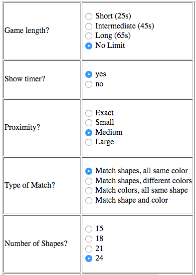

```{r setup, include=FALSE}
knitr::opts_chunk$set(echo = FALSE)
```
## Objective
In statistical hypothesis testing, many researchers use **p-value** as a measure of how strong/significant the results are such that the null hypothesis is true, i.e. the level of significance of the evidence in showing if there is a mean difference. However, without the understanding of the meaning of p-value and adequate prudence, people could falsely use p-value in scientific research that leads to misleading conclusions. John P. A. Ioannidis (2005) frankly expressed her concern in her paper [Why Most Published Research Findings Are False](http://journals.plos.org/plosmedicine/article?id=10.1371/journal.pmed.0020124) that "...simulations show that for most study designs and settings, it is more likely for a research claim to be false than true...it can be proven that most claimed research findings are false."

This lab aims to walk through a series of studies that all conduct similar tests but yielding various results, such that students can understand how p-value changes with the sample even with exactly the same population. 

***

## Outline
* Introduction to data source
* **Warning**: a preliminary study
* **Hypothesis test**: the first study
* **Hypothesis test**: the second study
* **Hypothesis tests**: the third study
* Discussion
* Further exploration


***

## Data 
Shapesplosion is an on-line game in which a person is expected to place specifically shaped pegs into the appropriate holes within a short time period. For several years students have used the Shapesplosion game to design an experiment and collect data. The following link allows you to play the game (http://web.grinnell.edu/individuals/kuipers/stat2labs/Perfection.html). 

Here are two screenshot of the game where the users can choose their preferred settings for the game. The image on the left is the start page which all users would encounter when playing the game, and the image on the left shows more specifics with regards to each variable.

{width=400 height=400}
{width=200 height=400}

In this lab, we will review data from multiple student groups that focused on a specific research question:

*“Does gender affect the time used to play Shapesplosion game?”*

***

## A preliminary study

Before we start, the following code will import your data as well as the R libraries for our analysis.

```{r,results='hide', message=FALSE}
library(mosaic)
library(ggplot2)
```

```{r}
## Reading in the data
group_data <- read.csv("cleaned_gender.csv")
```

**Question 1**: *Use the code below to create a dotplot and boxplot. These plots use the entire data set. How useful is this plot? In other words, is it useful/reasonable to conduct a hypothesis test on gender based on the entire data set?*


```{r graph1, echo=TRUE}
group_data$gender= as.factor(group_data$gender)
ggplot(data=group_data, aes(x=gender, y=TimeUsedSec)) + geom_boxplot()  + aes(colour=gender) + theme(legend.position="right") + labs(title="Figure 1: boxplot of full dataset") +   stat_summary(fun.y = mean, geom = "point", pch = 8, cex = 3)
```

#### Warning: DO NOT ever conduct a hypothesis test on the entire data set without understanding the data! We normally require __similar sample units__ as a criterion for conducting a meaningful hypothesis test; however, with the entire data set, this criterion is usually not met.

***

## The second study

Let’s star our official analysis on a new study, using the group_ID “MATH22015” with a sample size of 37, which is a subset of the full dataset.

```{r}
MATH22015<-group_data[group_data$groupID=="MATH22015",]
dim(MATH22015)[1]
MAT_female <- MATH22015[MATH22015$gender == 0,]$TimeUsedSec
MAT_male <- MATH22015[MATH22015$gender == 1,]$TimeUsedSec
MAT_t_test <- t.test(MAT_male,MAT_female,alternative="two.sided")
MAT_t_test
```

**QUestion 2**: *What can you conclude from the study?*

**Answer**: *This study resulted in a p-value of 0.0776. Using an alpha level of 0.1, this study would have evidence to reject the null hypothesis and concluded that gender indeed makes a difference in play time of the game.*

The graph also suggests that female players on average take less time to play the game than male players, contrary to our previous findings. Render the graph with the code below.


```{r graph}
MATH22015$gender= as.factor(MATH22015$gender)

ggplot(data=MATH22015, aes(x=gender, y=MATH22015$TimeUsedSec)) + geom_boxplot()  + theme(legend.position="top") + labs(title="Figure 2: MATH22015") + aes(colour = gender)+ 
  stat_summary(fun.y = mean, geom = "point", pch = 8, cex = 3)
```


***

## The second study

Take another subdataset with groupID = hjf190f14 with sample size 27, let us again conduct a hypothesis test on this group.

```{r}
mth22602 <-group_data[group_data$groupID=="mth22602",]
dim(mth22602)[1]
mth_female <- mth22602[mth22602$gender == 0,]$TimeUsedSec
mth_male <- mth22602[mth22602$gender == 1,]$TimeUsedSec
mth_t_test <- t.test(mth_male, mth_female, alternative="two.sided")
mth_t_test
```

With a p-value of 0.15, we surely fail to reject the null hypothesis when alpha = 0.1. Now let us take a look at the graph, from which we observe that male mean seems to be much higher than female mean, but still the hypothesis test failed.

```{r}
mth22602$gender<- as.factor(mth22602$gender)
mth22602_mean <- data.frame(gender = c(1,0), value = c(mean(mth22602[mth22602$gender ==1,]$TimeUsedSec), mean(mth22602[mth22602$gender ==0,]$TimeUsedSec)))
ggplot(data=mth22602, aes(x=gender, y=TimeUsedSec)) + geom_boxplot() + theme(legend.position="top") + labs(title="Figure 3: boxplot of mth22602 dataset") + aes(colour = gender) +  stat_summary(fun.y = mean, geom = "point", pch = 8, cex = 3) 
```

**Question 3**: *Write two to three sentences clearly explaining how two studies asking the same research questions with similar methodologies would get different results? Does this show evidence that one of the groups made an error somewhere in their data collection or analysis?*


**Answer**: *Statistics vary whenever we perform a study. Though population and methods remain identical*

***

## The third study:

#### Comparing multiple hypothesis tests

```{r}
group_data$gender <- as.factor(group_data$gender)

```

In Part 1 of this activity, we compared two different studies that evaluated the effect of gender on completion time of the shapesplosion game. Several additional studies on gender were conducted by multiple groups over multiple years. The following code conducts t-test and creates boxplots for several of these groups.


```{r plot, echo=TRUE}
### Add margin to add titles
par(mar=c(2,2,2,2))
par(mfrow = c(4,5))
groupName <- c()
pvalues <- c()

tb <- as.data.frame(table(group_data$groupID))
##Select groups that are under size 50
tb2 <- tb[tb$Freq >= 5 & tb$Freq <= 50,]
##Create a vector of groupID's whose size is between 25 and 50
selected_groupID <- as.character(tb2$Var1)
for (i in 1:length(selected_groupID)) {
  female <- group_data[group_data$groupID == selected_groupID[i] & group_data$gender == 0,]$TimeUsedSec
  male <- group_data[group_data$groupID == selected_groupID[i] & group_data$gender == 1,]$TimeUsedSec
  if (length(female) > 1 & length(male) > 1) {
    groupName <- cbind(groupName, selected_groupID[i])
    p <- round(t.test(female, male)$p.value, digits = 3)
    pvalues <- cbind(pvalues, p)
    data1 <- group_data[group_data$groupID == selected_groupID[i],]
    if (p < 0.1) {
      if (mean(female) < mean(male)) {
        boxplot(TimeUsedSec ~ gender,data=data1, col="green", main=paste("n=", dim(data1)[1], ",p=", p), xlab="Gender (1=Male, 0=Female)", ylab="Time Used Seconds")
      } else {
        boxplot(TimeUsedSec ~ gender,data=data1, col="red", main=paste("n=", dim(data1)[1], ",p=", p), xlab="Gender (1=Male, 0=Female)", ylab="Time Used Seconds")
      }
    } else {
      boxplot(TimeUsedSec ~ gender,data=data1, main=paste("n=", dim(data1)[1], ",p=", p), xlab="Gender (1=Male, 0=Female)", ylab="Time Used Seconds")
    }
  }
}

mtext("Figure 4", outer=TRUE,  cex=1, line=-1)

```


Figure 4 is a graphical representation of all 18 groups from the group dataset. The colored boxplots have p-value < 0.1.


**Question 4**: *What is the range of p-values observed in these studies?*

**Question 5**: *How many groups had higher mean times for females? How many groups had higher mean times for males?*

**Question 6**: *Which graph visibly appears to show the biggest difference between genders? What reasons could explain why this group did not observe a significant p-value?*

**Question 7**: *Why do the p-values differ?*

***

## Discussion: What exactly is p-value?

It is important to remember the definition of p-vlaue. In this context, it is the probability of obtaining a mean difference in play time between male and female players as extreme as we observed in our repective samples, on the premise that the null hypothesis–male and female players spend equal time on the game–is true.

Therefore, if the null hypothesis is false in the first place, that is if the population mean of female playtime and male playtime are indeed different, p-value does not imply information as meaningful as we thought.

***

## How credible is p-value?
#### The first Shiny applicaitons
It is noticeable that p-value is not reliable with repetition either. In our previous studies we observed that p-values differ when we sellect different groups of students and conduct hypothesis tests on each group. Is it a "group-specific thing"? Follow the [LINK]() and play around with this application. This application takes the entire data set as the population and randomly sample from the population with sample size of your choice. Take many samples and observe the variation of p-values. Now answer this, **how credible is p-value?**

#### The second Shiny application
Is this phenomenon due to our data set? Play around with this [APP]() .Suppose we can collect a population with a theoretical distribution and randomly sample from the population with parameters of your choice: theoretical distribution, sample size, sample mean, and sample standard deviation. Then conduct multiple tests. **How credible is p-value** in this case?

#### "The dance of p-value"
Now take a look at this [YouTube video](https://www.youtube.com/watch?v=5OL1RqHrZQ8) to get a better understanding of the **incredibility** of p-values.

