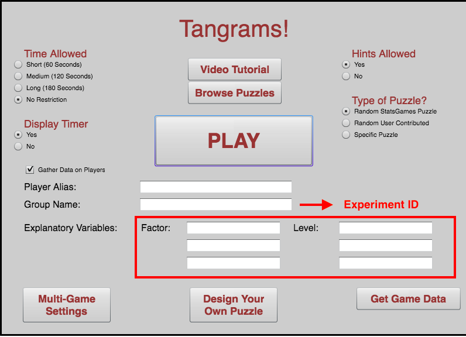
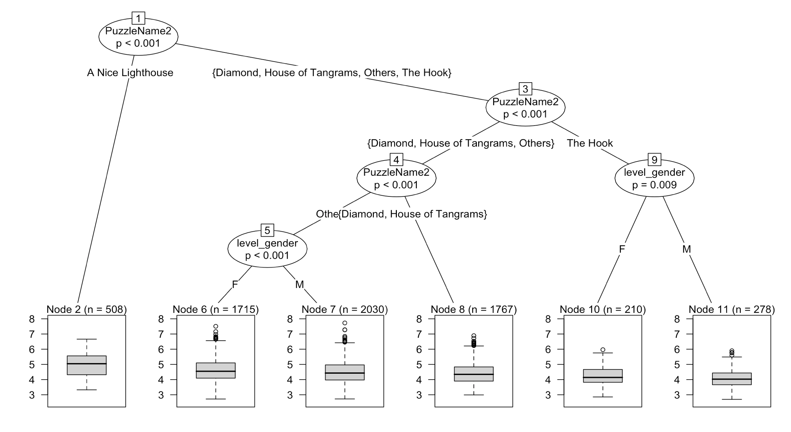

## Objective  
This lab aims at demonstrating some bad practices of experiment design and statistical analysis, and how these bad practices can give misleading conslusions. More particularly, we will look at the effect of __lurking variables__ and __sample size__ on p-value. After the lab, students should be able to understand at least 2 things:  
* __Lurking Variables:__ Though it's impossible to put all lurking variables into your analysis, it's important to design an experiment in a way that some lurking variables can be minimized, and to conduct a statistical analysis with the concern that some lurking variables might impact the conclusion.  
* __SampleSize:__ It is a misconception that all statistical analyses with big data sample give you the right conclusion. A well-designed experiment with 20 subjects might be better than a badly-designed experiment with 200 subjects.   

## Background: Tangram Game and Data
Tangrams is an ancient Chinese puzzle where players arrange geometrically shaped pieces into a particular design by flipping, rotating, and moving them. The online Tangrams game allows students the opportunity to design many versions of the original game. You can go to the Tangrams website and leave all the variables blank when you are simply trying out the game. However, if you want to find your completion time in the database of results, a specific course (Group Name) will be needed.  


In this activity, we will use Tangram database to look at some experiments (identified by __Group Name__) and to look at the collection of all experiments (about _50,000_ observations).

```{r setup, include=FALSE}
knitr::opts_chunk$set(echo = TRUE)
library(data.table)
library(plyr)
library(dplyr)
library(ggplot2)
library(mosaic)
library(party)
```

## 1. Getting Data
First, we want to import real time data from website. In order to make this dataset more dynamic for future use, we use the library __RCurl__ to import the most updated dataset into R instead of downloading the csv from the website.  
```{r, message=FALSE, warning=FALSE}
library(RCurl)
url <- "http://statgames.tietronix.com/tangrams/webreporter.php?game=tangrams&groupID=&winlose=both&random=false&rows=&type=csv"
tangram_data <- read.csv(textConnection(readLines(url)), stringsAsFactors = F)
```

## 2. Cleaning and Re-formating Data
For the future convinence, we change the type of the column into factor and some into numeric.   
```{r, message=FALSE, warning=FALSE}
tangram_data$RequestedTime <- as.numeric(tangram_data$RequestedTime)
tangram_data$NumClicks <- as.numeric(tangram_data$NumClicks)
tangram_data$TimeUsed <- as.numeric(tangram_data$TimeUsed)
tangram_data$NumShapes <- as.numeric(tangram_data$NumShapes)
```

You can see that this dataset is quite big and messy. Therefore, we need some initial data exploration to identify some biaes and outliers. The following plot uses __ggplot__ to visualize the _TimeUsed_ variable relative to _HintUsed_. You can use this algorithm and replace the variable names ( _x_ and _y_) to look at other aspects of the dataset.   
```{r, message=FALSE, warning=FALSE}
ggplot(data=tangram_data) + geom_point(mapping= aes(x=HintsUsed, y=TimeUsed))
```

As in the graph, we can see that there are multiple outliners which are biasing our data. Therefore, we want to eliminate those which are more than 3600 seconds(one hour). We also notice that the range of the data is relatively big. We want to take a log transformation on the data. The new dataset is tangram.   
```{r, message=FALSE, warning=FALSE}
tangram <- tangram_data[tangram_data$TimeUsed < 3600,]
tangram <- tangram[tangram$TimeUsed > 0,]
tangram$TimeUsed_log <- log(tangram$TimeUsed)
ggplot(data = tangram, aes(x=interaction(HintsEnabled,HintsUsed,lex.order = TRUE), y=TimeUsed)) + geom_boxplot()  + theme(legend.position="none") + labs(title="Boxplot for filtered data")+xlab("HintsEnabled.HintsUsed")  
```

As mentioned above, we plan to conduct analyses on multiple experiments identified by _Group Name_. However, there are some typos and cap inconsistency in the dataset, which is very typical of self-input data.  
```{r}
tangram$GroupName <- tolower(tangram$GroupName)
```

We do notice that there are multiple useful information in the customized factor and level section. The most interesting one is the gender information. We want to extract data with gender information from the larger dataset. 

```{r results = "hide", message=FALSE, warning=FALSE}
tangram <- as.data.frame(tangram)
### Factor to be filtered: GENDER
### A set of criteria for regular expressions/ key patterns
gen = c("^gen","^sex")
gen_male = c("^m","^h")
gen_female = c("^f", "^mu")

### ismatch
### @input: cond: a vector of key patterns (e.g. gen)
###         x, y, z: 3 columns to look for key
### @return: 0 if no match
###          index of the factor (1, 2, 3() if there is match
ismatch <- function(cond, x, y, z) {
  x <- grep(paste(cond, collapse = "|"), c(x, y, z), ignore.case = T, value = FALSE)
  return (ifelse(length(x), as.numeric(x), as.numeric(0)))
}

### level_gen_fun
### @input: x is the col index (given by factor_gender)
###         y is the row index
### @return: -1 if no gender factor indicated
###          -2 if gender factor indicated but level_gen key patterns not matched (require future manual check)
###           M/F
### @note: this function is specific to gender only. Needs to think about how to generalize it. 
level_gen_fun <- function(x, y) {
  return (ifelse(x == 0, -1, 
                 ifelse(grepl(paste(gen_female, collapse = "|"),tangram[y,2*x+3], ignore.case = T),
                        "F", 
                        ifelse(grepl(paste(gen_male, collapse = "|"),tangram[y,2*x+3], ignore.case = T),
                               "M",-2))))
}
tangram <- as.data.table(tangram)
tangram[, factor_gender := ismatch(gen, Factor1, Factor2, Factor3), by = 1:nrow(tangram)]
tangram <- as.data.frame(tangram)
tangram$level_gender <- mapply(level_gen_fun, tangram$factor_gender, 1:nrow(tangram), SIMPLIFY = TRUE)
gen_tangram <- tangram[tangram$level_gender == "F"|tangram$level_gender == "M",]
```

Now, there are two new columns in our dataset: factor_gender and level_gender. factor_gender indicates that whether this specific data entry contains gender information. level_gender indicates the specific gender information. In the level gender column, -1 means there is no gender information at all. -2 means that gender information is indicated, however, it does not match. F means Female and M means Male. We create a new dataset which contains all valid gender information. (gen_tangram)

```{r, message=FALSE, warning=FALSE}
ggplot(gen_tangram,aes(level_gender,TimeUsed_log)) +
  geom_boxplot(varwidth = TRUE,fill = "white", colour = "#3366FF",
               outlier.colour = "red", outlier.shape = 1) 
```

Another interesting factor that might influence _Time Used_ is _Puzzle Type_. After narrowing down the dataset to gender-included dataset, we take a look at the population of puzzle types by using thee __treemap__ package.   
```{r, message=FALSE, warning=FALSE}
statsgame <- c("Laughing Man", "Piano", "The Hook", "Complex Hexagon", "Diamond", "House of Tangrams",
               "A Nice Lighthouse", "The Brain Buster", "A Simple Chair", "The Hat Wearer",
               "The Acrobat", "The Bird", "Crouching Cat", "The Goat", "The Six", "The G",
               "Andy's Puzzle", "Walking Person Puzzle", "A Medicine Jar", "Candle")
gen_tangram$GameType <- "submitted"
gen_tangram$GameType[gen_tangram$PuzzleName %in% statsgame] <- "statsgame"
gen_tangram <- gen_tangram[gen_tangram$PuzzleName %in% statsgame,]
```

We do notice that there are two difference types of puzzles: built-in or submitted. Due to the complexity of the submitted puzzles, We only consider the built-in ones.  


# 3. Analyzing Data  
In this activity, we will conduct multiple statistical analyses in big and small datasets and in various ways to answer the same question: __"Does a player's gender influence his or her completion time of a game?"__  
This is a list of methods we will use:  
* T-test:
* ANOVA:
* Random Forest:
* CART Analysis:  
Recall that from now on, we will use **gen_tangram** to conduct our analysis.  

### T-test  
We start with the basic __T-test__ on all experiments with ID ( _Group Name_) to see whether the difference in _Time Used (log)_ between _Female_ and _Male_ group is significant at $\alpha = 0.1$.  

> Question 1: Use the following code to conduct t-test on all experiments with ID in the dataset and describe the distribution of p-value?       

```{r results = "hide"}

tangram_pvalue <- as.data.table(gen_tangram)
tangram_pvalue[, `:=`( SampleSize = .N) , by = GroupName] 
tangram_pvalue <- tangram_pvalue[tangram_pvalue$SampleSize >= 5,]
tangram_pvalue[, `:=`(log_timeused_mean = mean(TimeUsed_log), timeused_mean = mean(TimeUsed)), by = c("GroupName", "level_gender")]
tangram_pvalue[, `:=`(n = .N, sd = sd(TimeUsed_log)), by = c("GroupName", "level_gender")]

ttestFun <- function(dat) {
  if (sum(dat$level_gender == "F") > 1 && sum(dat$level_gender == "M") > 1) {
    the_fit <- t.test(TimeUsed_log ~ level_gender, data = dat)
    #setNames(the_fit$p.value, "p.value")}
    c("p.value" = the_fit$p.value, "samplesize" = mean(dat$SampleSize))}
  else {
    c("p.value" = -1, "samplesize" = mean(dat$SampleSize))
  }
}
alpha <- 0.1
gender_pval_dist <- ddply(tangram_pvalue, ~ GroupName, ttestFun)
gender_pval_dist$significant <-(gender_pval_dist$p.value < alpha)*1
gender_pval_dist$significant <- as.factor(gender_pval_dist$significant)
```
```{r}
ggplot(gender_pval_dist[gender_pval_dist$p.value != -1,], aes(p.value)) +
  geom_histogram(binwidth = 0.01, position = "identity", alpha = 0.5, colour = "black", fill = "white")
```

> Question 2: We also want to see how p-value changes relative to the experiment's sample size. Use the following code to draw a scatterplot of p-value vs. sample size. How many experiments show a signficant p-value? Does big sample size guarantee a stable and reliable p-value?    

```{r}

ggplot(gender_pval_dist[gender_pval_dist$p.value != -1,], aes(x = samplesize, y = p.value)) + 
  geom_point(aes(colour = significant)) +
  scale_color_manual(values=c("black", "red")) +
  geom_hline(aes(yintercept = alpha), color = "red") +
  geom_text(aes(100,0.1,label = "Significant level = 0.1", vjust = -1), color = "red") +
  scale_x_continuous(name="Sample Size", limits=c(0, 125)) +
  scale_y_continuous(name="t-test p-value", limits=c(0, 1), breaks = seq(0,1, by = 0.1)) 
```

> Question 3:  Now let's look at the sampling distribution of Female and Male group. Use the following code to visualize the sampling distributuion of Time Used and Time Used (log) in two groups. Do you think there is a significant difference? Explain some concerns in drawing the conclusion.  

```{r results = "hide"}
gender_samplingdis <- as.data.table(gen_tangram)
gender_samplingdis[,`:=`(SampleSize = .N), by = GroupName]
gender_samplingdis[, `:=`(log_timeused_mean = mean(TimeUsed_log), timeused_mean = mean(TimeUsed)), by = c("GroupName", "level_gender")]
gender_samplingdis[, `:=`(n = .N, sd = sd(TimeUsed_log)), by = c("GroupName", "level_gender")]
gender_samplingdis <- gender_samplingdis[,c("GroupName", "level_gender", "SampleSize", "timeused_mean", "log_timeused_mean","n","sd"), with = FALSE]
gender_samplingdis <- gender_samplingdis[!duplicated(gender_samplingdis),]

### Aggregate data for vertical lines
gender_samplingdis_vline <- gender_samplingdis %>%
  group_by(level_gender) %>%
  summarise(log_timeused_mean = mean(log_timeused_mean), timeused_mean = mean(timeused_mean))
```
```{r}
ggplot(gender_samplingdis, aes(timeused_mean, fill = level_gender)) + 
  geom_density(alpha = 0.3) +
  geom_vline(data=gender_samplingdis_vline, aes(xintercept=timeused_mean,  colour=level_gender),
               linetype="dashed", size=1) +
  labs(title = "Distribution of Sample Means of Different Gender Levels") +
  labs(x = "Sample Mean", y = "Density") +
  ylim(0.00, 0.025) +
  scale_x_continuous(minor_breaks = seq(0, 200, by = 25))

ggplot(gender_samplingdis, aes(log_timeused_mean, fill = level_gender)) + 
  geom_density(alpha = 0.3) +
  geom_vline(data=gender_samplingdis_vline, aes(xintercept=log_timeused_mean,  colour=level_gender),
               linetype="dashed", size=1) +
  labs(title = "Distribution of Sample Means of Different Gender Levels") +
  labs(x = "Sample Mean (log)", y = "Density") +
  ylim(0.00, 1.00)
```


### ANOVA 
The limitation of t-test is that we cannot take multiple factors into consideration. Therefore, the analysis might not be reliable due to the existence of lurking variables. Therefore, we will proceed with ANOVA to see how the conclusion changes when we put other factors besides _Gender_ into the analysis.     

```{r, message=FALSE, warning=FALSE}
puzzlename <- c("A Nice Lighthouse", "Diamond", "House of Tangrams", "The Hook")
gen_tangram$PuzzleName2 <- ifelse(gen_tangram$PuzzleName %in% puzzlename, gen_tangram$PuzzleName, "Others")
gen_tangram$PuzzleName2 <- as.factor(gen_tangram$PuzzleName2)

```

```{r}
test <- aov(TimeUsed_log ~ level_gender, data=gen_tangram)
summary(test)
ggplot(gen_tangram,aes(level_gender,TimeUsed_log)) +
  geom_boxplot(varwidth = TRUE,fill = "white", colour = "#3366FF",
               outlier.colour = "red", outlier.shape = 1) 
```
  
> Question 4: Through the p-value of this anova test, we can conclude that there are difference between different gender. However, can we conclude that that conclusion can apply to any puzzle we have. In another words, does the conclusion derived from a big dataset apply to small subsets?  

When we take a look at the "A Nice Lighthouse"
```{r}
light <- filter(gen_tangram,PuzzleName2 == "A Nice Lighthouse")
test.light <- aov(TimeUsed_log ~ level_gender, data=light)
summary(test.light)
ggplot(light,aes(level_gender,TimeUsed_log)) +
  geom_boxplot(varwidth = TRUE,fill = "white", colour = "#3366FF",
               outlier.colour = "red", outlier.shape = 1)
```

Similary, that can apply to Diamond.  
```{r}
diamond <- filter(gen_tangram,PuzzleName2 == "Diamond")
test.diamond <- aov(TimeUsed_log ~ level_gender, data=diamond)
summary(test.diamond)
ggplot(diamond,aes(level_gender,TimeUsed_log)) +
  geom_boxplot(varwidth = TRUE,fill = "white", colour = "#3366FF",
               outlier.colour = "red", outlier.shape = 1)
```

And House of Tangram  
```{r}
house <- filter(gen_tangram,PuzzleName2 == "House of Tangrams")
test.house <- aov(TimeUsed_log ~ level_gender, data=house)
summary(test.house)
ggplot(diamond,aes(level_gender,TimeUsed_log)) +
  geom_boxplot(varwidth = TRUE,fill = "white", colour = "#3366FF",
               outlier.colour = "red", outlier.shape = 1)
```

###Extra
How can we find those groups with different outcomes. __classification tree__ is a good tool to visualize those groups. A decision tree to help you to find out different outcomes from different groups at once. For example, if we want to see whether there is a difference between hints-enabled and hints-disabled. We use __ctree__ from __party__ package. 

```{r}
fit <- ctree(TimeUsed_log ~ HintsEnabled+HintsUsed, 
   data=na.omit(gen_tangram))
plot(fit)
```

### Practice

Consider a code to draw a graph similar to the graph below. 

